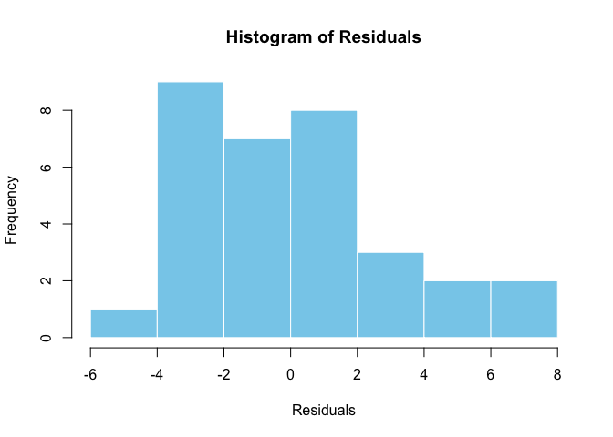
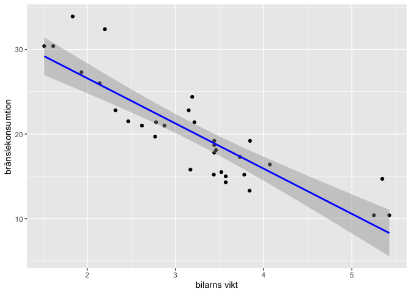

## Data att använda

För att kunna se hur regression fungerar i praktiken så behöver vi data. Jag har valt att använda mtcars dataset som medföljer R. Vi börjar med att titta på hur datasetet ser ut


```
##                    mpg cyl  disp  hp drat    wt  qsec vs am gear carb
## Mazda RX4         21.0   6 160.0 110 3.90 2.620 16.46  0  1    4    4
## Mazda RX4 Wag     21.0   6 160.0 110 3.90 2.875 17.02  0  1    4    4
## Datsun 710        22.8   4 108.0  93 3.85 2.320 18.61  1  1    4    1
## Hornet 4 Drive    21.4   6 258.0 110 3.08 3.215 19.44  1  0    3    1
## Hornet Sportabout 18.7   8 360.0 175 3.15 3.440 17.02  0  0    3    2
## Valiant           18.1   6 225.0 105 2.76 3.460 20.22  1  0    3    1
## Duster 360        14.3   8 360.0 245 3.21 3.570 15.84  0  0    3    4
## Merc 240D         24.4   4 146.7  62 3.69 3.190 20.00  1  0    4    2
## Merc 230          22.8   4 140.8  95 3.92 3.150 22.90  1  0    4    2
## Merc 280          19.2   6 167.6 123 3.92 3.440 18.30  1  0    4    4
```
Vi väljer att titta på hur bränslekonsumtion (mpg) är en funktion av bilens vikt (wt). Vi skriver detta som 

$$
y = \beta_0 + \beta_1 x + \epsilon
$$

## Antaganden i regression

- #1 **Normalitet**. Residualerna ska vara normalfördelade, inte variablerna!

- #2 **Linjaritet**. Det ska föreligga ett linjärt samband mellan variablerna

- #3 **Homogenitet av varians**. Residualerna ska ha en "jämn" varians.

## Antagande om normalitet

<!-- -->

## Antaganden om linjaritet


```
## `geom_smooth()` using formula = 'y ~ x'
```

<!-- -->

## Hur får man fram beta koefficienterna?


